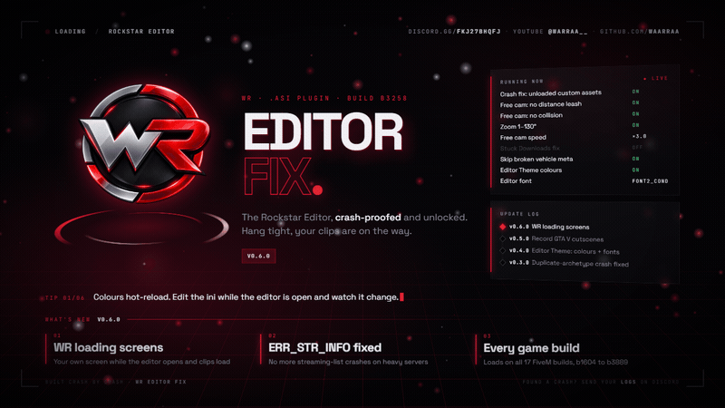

# WR Editor Fix

**Version: v0.6.0**

Discord: https://discord.com/invite/FKJ27bhqfJ  |  YouTube: https://www.youtube.com/@Warraa__

A FiveM `.asi` plugin that fixes the Rockstar Editor crashing when a clip
references a custom asset (vehicle / MLO / prop / ytyp) that got unloaded,
plus a few optional quality-of-life tweaks for the editor's free camera,
your own colours and font for the editor's menus, recording real GTA V
cutscenes - and, new in v0.6.0, WR loading screens for the editor and a fix
for the "ERR_STR_INFO" game errors on heavy servers.

## ⚠️ Important — read before you install

**This does not remove 100% of Rockstar Editor crashes.** It fixes the most
common crashes found and confirmed so far. There are almost certainly other
crashes out there that haven't been found yet, or that have been found but
don't have a safe fix yet (see "Known issues" below). Installing this
should mean you crash a lot less, not that you'll never crash again.

**Not every fix applies to every server.** Most of these crashes are caused
by a specific server's custom assets — a duplicated map archetype, a
malformed vehicle file, a broken clothing model. The fix for one server's
crash often does nothing for another server's, because it's a different
broken file on a different code path. That's why this gets built crash by
crash, from real logs and dumps, rather than one blanket "fix everything"
switch. If your server hasn't had its crash looked at yet, it may still
crash exactly as before.

**Tested on game build b3258.** Everything in this plugin was built and
tested on FiveM's game build **b3258** (Legacy). The plugin knows and loads on every
game build FiveM supports (table below) and the log names yours, but only b3258 is
tested. On the others, **you are the tester**: it may work, some fixes may
not apply (the game's code sits at different places), and parts built for
b3258 switch themselves off. If you're on another build, your logs and crash
dumps are what gets it working there — see **"Found a new crash?"** below.

Your game build is the number in the crash window (`GTA5_b3258.exe`) or the
`Game build:` line near the top of `WR_Editor_Fix.log`.

| Build | GTA V update | Status |
|---|---|---|
| b1604 | Arena War | community testing |
| b2060 | Los Santos Summer Special | community testing |
| b2189 | Cayo Perico Heist | community testing |
| b2372 | Los Santos Tuners | community testing |
| b2545 | The Contract | community testing |
| b2612 | The Contract (mpg9ec) | community testing |
| b2699 | The Criminal Enterprises | community testing |
| b2802 | Los Santos Drug Wars | community testing |
| b2944 | San Andreas Mercenaries | community testing |
| b3095 | The Chop Shop | partly checked (one editor session) |
| **b3258** | **Bottom Dollar Bounties** | **tested** |
| b3323 | title update after Bottom Dollar Bounties | community testing |
| b3407 | Agents of Sabotage | community testing |
| b3570 | Money Fronts | community testing |
| b3751 | A Safehouse in the Hills | community testing |
| b3788 | 2026 patch 1 | community testing |
| b3889 | The Kortz Center Heist | community testing |

Good to know: on servers running current FiveM, a build **lower** than b3258
(for example `sv_enforceGameBuild 3095`) still runs the **b3258 game exe**
with that build's content, so everything here applies as on b3258. Only
servers on old FiveM versions put you on the real older exe. Builds
**higher** than b3258 always run their own exe. GTA V Enhanced is not
supported.

If you hit a crash this doesn't catch, see **"Found a new crash?"** near the
bottom — I do want to know about it and will try to fix it.

## What it fixes

The Rockstar Editor crashes when it tries to read a custom asset that's
already been unloaded from memory (a freed pointer read). This plugin
catches that specific crash pattern safely and lets the editor keep running
instead of closing. A prevented crash may make a custom prop look missing
in the editor **preview only** — your recorded clips and exports are
unaffected.

## Features (v0.6.0)

**Crash fix — on by default:**
- **New in v0.6.0:** fixes the `RAGE error: ERR_STR_INFO_2` and
  `ERR_STR_INFO_3` game errors (`[Crash Fix] GrowStreamingList`, game build
  b3258). The game keeps a fixed list of 32768 streaming entries. On heavy
  servers the world alone uses about 28000 of them, so a teleport, a cutscene
  loading or an editor export fills the rest and the game stops. When the
  list runs full, the plugin adds more room to it instead. Works in game and
  in the editor.
- Stops the Rockstar Editor crashing when switching, editing, or exporting
  clips that reference a custom asset (vehicle, MLO, prop, ytyp) which got
  unloaded. This is the core fix and covers every known variant of this
  crash found so far.
- Also catches the same crash pattern in FiveM's streaming/asset-unload
  code on heavy custom-asset servers, not just the editor itself.
- Fixes the crash on servers with many duplicate or
  conflicting map archetypes (`diet-queen-carbon` /
  `india-connecticut-arizona`), where the editor walked a lookup table that
  was never filled in. Field-confirmed on a server where the clip had
  crashed on every single attempt.
- Catches a divide-by-zero that the recovery itself
  could trigger, and stops multi-site runaway loops before they corrupt
  memory.
- Fixes a crash when loading another clip after the first one, where one of the plugin's own built-in guards was handed a broken
  pointer that looked valid.
- Fewer crashes on clips with lots of players (more than 32): the editor no longer loops forever over a player slot it never filled
  in (`cold-cardinal-mountain` and its b3095 versions). The editor itself is
  built for 32 players, so very big clips can still crash later or show
  wrong faces on the extra players.
- When the game raises its own fatal error
  (`RAGE error: ERR_...`), FiveM now reports it cleanly instead of the plugin
  turning it into a second, confusing crash.
- The log says which game build you're on, and parts built for b3258
  switch themselves off on other builds. **New in v0.6.0:** the plugin loads
  on every game build FiveM supports (it used to refuse to load on some), and
  the log names the GTA V update and how far that build is tested.

**Experimental, on in the shipped `.ini` — `[Vehicle Meta] SkipBrokenVehicleMeta`:**
- For servers that ship a vehicle with a broken `carvariations`/`handling`
  file. Symptom: clips play fine but the moment one using that car is added
  to a project the editor hangs and dies with "Out of game memory". Turn
  this on and the plugin remembers any vehicle file the game itself reports
  as malformed and skips it from then on (saved in `WR_BrokenVehicleMeta.txt`).
  It learns on the first failure, so the very first attempt can still crash
  once - relaunch and it's skipped.

**Editor free camera — on by default, each independently toggleable:**
- Remove the distance leash that pulls the free-cam back when it flies far
  from the subject (custom max distance).
- Uncap the zoom/FOV range past the stock ~10-100° (up to 1-130°).
- Disable free-cam collision with world geometry.
- Scale the free-cam's move speed (adjustable multiplier, updates live
  while flying — no relaunch needed).

**Editor Theme, on in the shipped `.ini` (red menu text, purple greyed rows,
condensed font) — `[Editor Theme]`:**
- **Colours:** `MenuText` recolours the menu labels, values and the
  timeline playhead; `MenuTextGreyed` recolours greyed-out rows, the
  timeline's played region and the second timecode. Plain `RRGGBB` hex
  (`E01234` = WR red). Applied only while the editor is open and put back
  the moment you leave it, so the rest of the game's UI is never changed.
  Hot-reloads - edit, save, see it within a second.
- **Font:** `EditorFont` swaps the editor's UI font for one of the game's
  own built-in fonts:
  - `Font5` - handwriting / script
  - `Font2_cond` - condensed
  - `RockstarTAG` - all caps (a few symbols like `%` `.` `:` are missing)
  - `gtaCash` - Pricedown, the GTA logo font
  - empty / `Font2` - stock

  Needs a FiveM relaunch after changing it. The Rockstar Editor's own
  main menu (the project list) keeps the stock font for now - everything
  inside the editor gets the new one.

**Record GTA V cutscenes (game build b3258), on by default:**
- **`[Recording] AllowCutsceneRecording`:** the Rockstar Editor keeps
  recording while a real GTA V cutscene plays or loads (for example one a
  server script starts). Normally the game stops the recording the moment you
  aren't in control of your character, and the clip fails with "Clip must
  be at least longer than 3 seconds". The cutscene's actors, camera and audio
  all end up in the clip. Scripts that block recording on purpose still work.
- **`[Editor Camera] FreeCameraOnBlockedClips`:** the editor normally locks the
  camera on such clips ("You cannot edit camera properties as this clip
  contains a blocked cutscene"), and on clips recorded in first person. This
  unlocks the marker's Cameras menu and lets the free camera move on them.
- Known limit: recording doesn't continue while a script camera flies over
  the cutscene (a server's own cutscene camera tool).
- On other game builds both switch themselves off, and the log says so.

**New in v0.6.0 — WR loading screens, on in the shipped `.ini` —
`[Editor Loading Screen]`:**
- **Editor launch screen (`LaunchScreen`):** press "Rockstar Editor" + Yes in
  FiveM's main menu and the WR screen shows at once, instead of FiveM's own
  one. It shows live load progress, a "Running now" list of what's on in
  your `.ini`, and the update log from GitHub - with an "Update available"
  box when a newer version is out. It closes by itself when the editor is
  ready; double-click it to close it early. It stays out of the way at the
  main menu and when you join a server.
- **Clip screen (`ClipScreen`):** a minimal WR screen while a clip loads
  (Edit) or an export starts, instead of the stock "Preparing clip" screen.
  It closes the moment the editor is ready.
- `UpdateCheck = 0` stops the GitHub request (the built-in update log is
  shown instead).
- Both need the **Microsoft Edge WebView2 Runtime**: built into Windows 11, and
  on Windows 10 it comes with Microsoft Edge. If it's missing, the log says so
  and FiveM's own screens are used. Works best with the game in
  "Windowed Borderless".
- **Tested on Windows 11.** On Windows 10, or if anything looks wrong while the
  editor opens (black / white / frozen screen, flickering, the game
  minimising, a missing or double mouse cursor), set `LaunchScreen = 0` and
  `ClipScreen = 0`. FiveM's own screens come back and nothing else changes.
  Please send your logs on Discord so it can be fixed.

## Known issues / what's being worked on

- **The WR loading screens are only tested on Windows 11** (see above).
  Pressing Export a second time in the same session can show the clip
  screen a few seconds late.
- **Only tested on game build b3258.** Every other build in the table above
  is tested by the people who play on it. A crash already fixed on b3258 can
  still happen on another build, because the fix has to be matched to each
  build's code separately.
- **On very heavy servers, editing a clip and then exporting in the same
  session can still crash on export** (`alabama-twenty-hawaii`,
  `GTA5_b3258.exe+600FB30`). Leaving the edit screen makes the game reload
  its replay content, and on some servers that reload trips over a freed
  object. Workaround that works today: edit and save your project, relaunch
  FiveM, open the already-edited clip and export it without editing again.
  Actively being investigated - the cause is now understood, the safe fix
  isn't finished.
- An experimental fix for the editor hanging on "Downloading assets" is
  now exposed in the config (`[Stuck Downloads]`), off by default. Less
  battle-tested than the core crash fix above — only turn it on if you
  actually hit that infinite hang.

## What might come in future updates

No promises on timing — solo project, worked on as time allows:
- More of the editor themeable: the selected-row highlight, headers,
  timeline strip colours, and the new font on the editor's main menu too.
- A fix for the vehicle-data crash mentioned above, if a safe one is found.
- Camera roll/tilt control unlock.
- Export resolution/framerate unlock.
- Camera position/speed presets (bookmarks).
- Auto-save while editing, so a crash never loses your work.

Check back on this repo for updates — new versions will be numbered v0.7.0,
v0.8.0, and so on as they ship. Full version history: `CHANGELOG.md`.

## Install

1. Download `WR_Editor_Fix.asi` and the `WR Editor Fix` folder (with its
   `.ini` inside) from this release.
2. Copy **both** into your FiveM `plugins` folder:
   `%LOCALAPPDATA%\FiveM\FiveM.app\plugins\`
3. Relaunch FiveM.

That's it — the crash fix and the main features are already on in the
shipped `.ini`. Open `WR_Editor_Fix.ini` if you want to turn anything on, off
or adjust it.

**Verifying your download:** the SHA256 checksum for `WR_Editor_Fix.asi` is
in `WR_Editor_Fix.asi.sha256`. If you're ever unsure a copy is genuine
(re-shared somewhere other than the official release page), check it
matches.

**Note:** this plugin does not create its own folder or config file. If you
skip step 2, it will just run on its built-in defaults with no log file —
make sure the `WR Editor Fix` folder actually ends up next to the `.asi`.

## Configuration

Open `WR Editor Fix\WR_Editor_Fix.ini` in a text editor. Every option has a
comment explaining what it does. (Developer/diagnostic settings are kept in a
separate file that isn't part of the release — you don't need it.) The
`[Editor Camera]` section and the `[Editor Theme]` colours reload live
while FiveM is running — edit, save, and it applies within a second, no
relaunch needed. Everything else (including `EditorFont`,
`FreeCameraOnBlockedClips`, `[Recording]`, `GrowStreamingList` and
`[Editor Loading Screen]`) needs a relaunch to take effect.

## A heads-up about antivirus / Windows Defender

This plugin works by reading and patching the game's own memory at runtime
(the same category of technique every `.asi` crash-fix/mod uses). Some
antivirus software flags this behavior heuristically even when nothing
malicious is happening. If it gets quarantined or blocked, you may need to
add an exclusion for it. Use your own judgement — only download this from
the official release page.

## Found a new crash?

**Please don't open a GitHub Issue for this — use Discord instead**, it's
the only place support requests actually get seen.

If you hit a Rockstar Editor crash that this plugin doesn't already catch,
I want to know — I'll try to build a fix for it. Please:

1. Contact **Warraa_** on Discord: https://discord.com/invite/FKJ27bhqfJ
2. Open a support ticket.
3. Send:
   - The crash dump file (the `.zip` FiveM saves when it crashes — the crash
     window itself tells you where it saved it, and gives a copy-to-upload
     option).
   - A screenshot of the actual crash window/error message.
   - **All** the log files from `WR Editor Fix\Logs\` (next to the `.asi`,
     in your FiveM `plugins` folder) — `WR_Editor_Fix.log` and anything else
     in that `Logs` folder.
   - If a `WR Editor Fix\Dev Logs\` folder exists, send everything in it
     too. Those files only appear when the plugin catches a specific crash
     shape, and they're the most useful thing you can send — they're what
     solved the duplicate-archetype crash.

The more of that you send, the faster I can actually find and fix it —
missing pieces (especially the logs) usually means I can't reproduce it.

YouTube: https://www.youtube.com/@Warraa__

## Disclaimer

Not affiliated with or endorsed by Rockstar Games, Take-Two Interactive, or
Cfx.re. Use at your own risk.

## License

Closed source. You're free to download and use this for personal or server
use. Do not redistribute, resell, decompile, or repackage it. Source is not
published.

Third-party components used are credited in `THIRD-PARTY-NOTICES.txt`.
